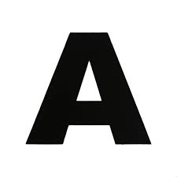

# Titulo primer nivel 
## Segundo nivel
### Tercer nivel

Hola que tal como estas

Diferente parrafo
osea que lo que puedas

**negrita** y *cursiva* 

La funcion `print()` de Python

```python
print("Hola Mundo")
```

Listas:
- Primer elemento
- Segundo elemento
  - Segundo nivel 
    - Tercer nivel
  
1. Primer elemento
2. Segundo elemento
    1. Segundo nivel
   

[Texto del enlace](https://google.com)

