## Ejercicio 1 

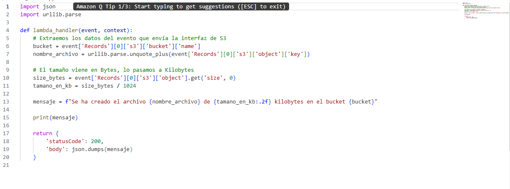
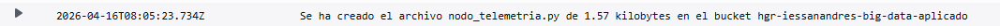

## Ejercicio 2

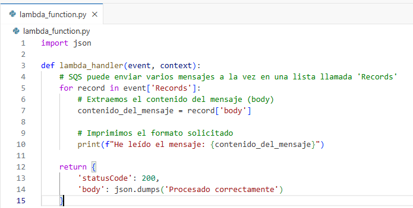
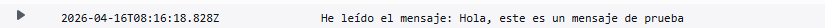

## Ejercicio 3

```python
import json
import urllib.parse
import boto3  # La librería para comunicarse con otros servicios de AWS

# Inicializamos el cliente de SQS fuera del handler para mejor rendimiento
sqs = boto3.client('sqs')
# REEMPLAZA ESTA URL con la que copiaste en el paso 1
QUEUE_URL = 'https://sqs.us-east-1.amazonaws.com/381491882941/ColaDeProcesamiento'

def lambda_handler(event, context):
    # 1. Extraer datos del evento S3
    bucket = event['Records'][0]['s3']['bucket']['name']
    nombre_archivo = urllib.parse.unquote_plus(event['Records'][0]['s3']['object']['key'])
    size_bytes = event['Records'][0]['s3']['object'].get('size', 0)
    tamano_kb = size_bytes / 1024

    # 2. Crear el cuerpo del mensaje
    # Lo enviamos como JSON para que sea fácil de leer por otro sistema
    datos_archivo = {
        "archivo": nombre_archivo,
        "tamano_kb": round(tamano_kb, 2),
        "bucket": bucket,
        "mensaje": f"Procesar archivo {nombre_archivo}"
    }

    # 3. Enviar el mensaje a SQS
    try:
        respuesta = sqs.send_message(
            QueueUrl=QUEUE_URL,
            MessageBody=json.dumps(datos_archivo)
        )
        print(f"Mensaje enviado a SQS. ID: {respuesta['MessageId']}")
    except Exception as e:
        print(f"Error enviando a SQS: {str(e)}")
        raise e

    return {
        'statusCode': 200,
        'body': json.dumps('Datos enviados a la cola correctamente')
    }
```

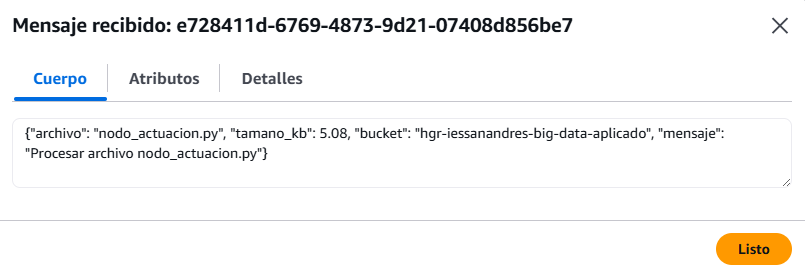

## Ejercicio 4

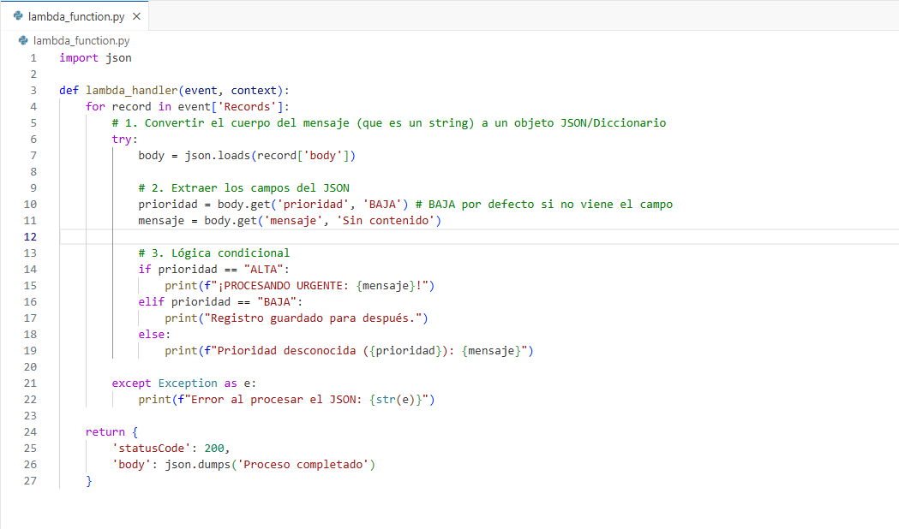
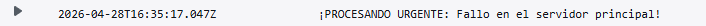

## Ejercicio 5


```python
import boto3
import json

# 1. Configuramos el cliente (especifica tu región, ej: 'us-east-1')
sqs = boto3.client('sqs', region_name='us-east-1')

# 2. URL de tu cola (Cópiala de la consola de SQS)
queue_url = 'https://sqs.us-east-1.amazonaws.com/381491882941/MiBuzon'

# 3. Definimos los datos del mensaje
# Prueba cambiando la prioridad de ALTA a BAJA
datos_archivo = {
    "prioridad": "ALTA",
    "mensaje": "Mensaje enviado desde mi script local"
}

# 4. Serializamos el diccionario a string JSON
mensaje_serializado = json.dumps(datos_archivo)

try:
    # 5. Enviamos el mensaje
    response = sqs.send_message(
        QueueUrl=queue_url,
        MessageBody=mensaje_serializado
    )
    print(f"Mensaje enviado con éxito. ID: {response['MessageId']}")

except Exception as e:
    print(f"Error al enviar: {str(e)}")
```

    Mensaje enviado con éxito. ID: c6fca0df-ae52-4d03-80f2-325a6d84b322


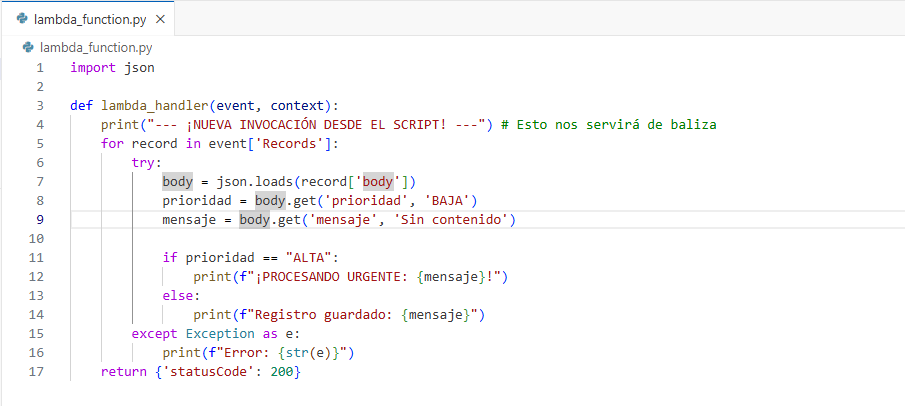
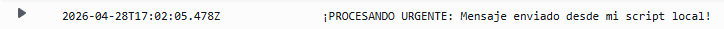

## Ejercicio 6

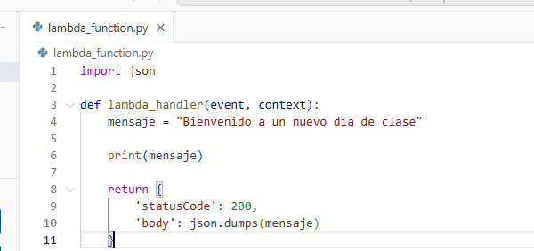
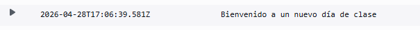

## Ejercicio 7

```python
import json
import boto3

def lambda_handler(event, context):
    # 1. Configurar el cliente de S3
    s3 = boto3.client('s3')
    
    # 2. NOMBRE DE TU BUCKET (Cámbialo por el tuyo)
    nombre_bucket = 'pro601hugogarmon'
    
    try:
        # 3. Llamar a list_objects_v2
        respuesta = s3.list_objects_v2(Bucket=nombre_bucket)
        
        # 4. Comprobar si el bucket tiene archivos
        # Si el bucket está vacío, la clave 'Contents' no existe
        if 'Contents' in respuesta:
            numero_archivos = len(respuesta['Contents'])
        else:
            numero_archivos = 0
            
        mensaje = f"En el bucket {nombre_bucket} hay {numero_archivos} archivos actualmente."
        print(mensaje)
        
    except Exception as e:
        print(f"Error al acceder al bucket: {str(e)}")
        return {'statusCode': 500, 'body': str(e)}
    
    return {
        'statusCode': 200,
        'body': json.dumps(mensaje)
    }
```
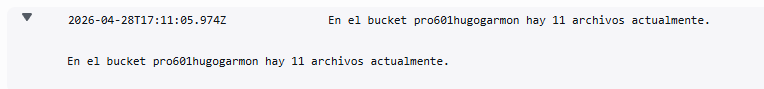

## Ejercicio 8

```python
import json
import urllib.parse
import boto3

# Inicializamos el cliente de SQS
sqs = boto3.client('sqs')

# PEGA AQUÍ TU URL
QUEUE_URL = 'https://sqs.us-east-1.amazonaws.com/381491882941/ColaDeProcesamiento'

def lambda_handler(event, context):
    # 1. Extraer datos del evento de S3
    bucket = event['Records'][0]['s3']['bucket']['name']
    nombre_archivo = urllib.parse.unquote_plus(event['Records'][0]['s3']['object']['key'])
    size_bytes = event['Records'][0]['s3']['object'].get('size', 0)
    
    # 2. Convertir a KB
    tamano_en_kb = round(size_bytes / 1024, 2)
    
    # 3. Preparar el mensaje con el formato solicitado
    texto_mensaje = f"Archivo registrado: {nombre_archivo} | Tamaño: {tamano_en_kb} KB"
    
    try:
        # 4. Enviar a SQS
        sqs.send_message(
            QueueUrl=QUEUE_URL,
            MessageBody=texto_mensaje
        )
        print(f"Mensaje enviado con éxito: {texto_mensaje}")
        
    except Exception as e:
        print(f"Error enviando a SQS: {str(e)}")
        raise e

    return {
        'statusCode': 200,
        'body': json.dumps('Proceso completado')
    }
```
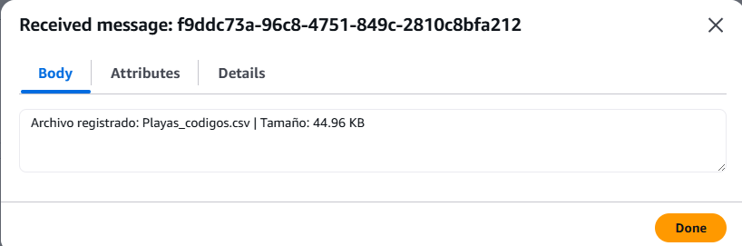

